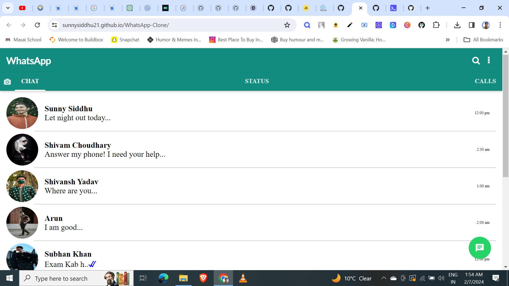

# WhatsApp Frontend Clone

A simple and lightweight WhatsApp frontend clone built using HTML, CSS, and JavaScript. This project replicates the user interface of WhatsApp, allowing users to send messages, view chat history, and more.



## Table of Contents

- [Demo](#demo)
- [Features](#features)
- [Technologies Used](#technologies-used)
- [Getting Started](#getting-started)
- [Usage](#usage)
- [Contributing](#contributing)
- [License](#license)

## Demo

https://sunnysiddhu21.github.io/WhatsApp-Clone/

## Features

- **Real-time Messaging:** Send and receive messages instantly.
- **Chat History:** View and scroll through chat history.
- **Responsive Design:** Works seamlessly on desktop and mobile devices.
- **Simple Interface:** Intuitive UI inspired by WhatsApp.

## Technologies Used

- **HTML:** Structure of the web pages.
- **CSS:** Styling and layout.
- **JavaScript:** Logic and interactivity.
  

## Getting Started

To run the project locally, follow these steps:

1. Clone the repository:

   ```bash
   git clone https://github.com/your-username/whatsapp-clone.git

2. Open the project folder:

   ```bash
   cd whatsapp-clone

3. Open index.html in your preferred web browser.
